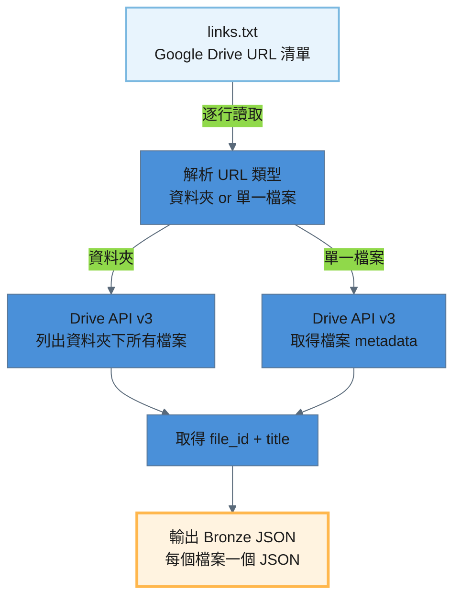
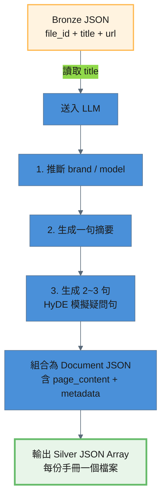

# Google Drive 處理流程

Google Drive 產品手冊從 URL 清單到進入 pgvector 知識庫，經過三個處理階段：

```
Source (URL 清單) → Bronze JSON → Silver JSON → Gold (pgvector)
```

> **特殊性**：與其他資料源不同，Google Drive 管線**不讀取手冊內容本身**，而是透過檔名推斷 metadata 並生成 HyDE 疑問句，讓使用者能檢索到對應手冊的 Google Drive 連結。

---

## 階段一：Source → Raw（URL 清單）

### 1.1 處理策略

Google Drive 的資料夾 / 檔案 URL 由人工維護於純文字檔案 `storage/raw/gdrive/links.txt`，每行一個 URL，支援 `#` 開頭的註解行與空行。支援**資料夾 URL**（自動列出資料夾下所有檔案）與**單一檔案 URL**。

### 1.2 URL 清單內容

```
https://drive.google.com/drive/u/0/folders/1vzLX38znSNvgMUionQ-V71cvhr0SujP8
```

| 項目 | 說明 |
|------|------|
| 檔案路徑 | `storage/raw/gdrive/links.txt` |
| 格式 | 純文字，每行一個 Google Drive URL |
| 目前 URL 數 | 1 個資料夾（含 19 份手冊檔案） |

---

## 階段二：Raw → Bronze（Google Drive API 索引擷取）

### 2.1 處理策略

讀取 `links.txt` 中的 URL，透過 Google Drive API v3（Service Account 認證）解析資料夾內容或單一檔案資訊，取得 `file_id` 和 `title`（檔案名稱），存為 Bronze JSON。

**腳本**：`pipeline/raw_to_bronze/process_gdrive.py`

```bash
# 全量處理
python pipeline/raw_to_bronze/process_gdrive.py --verbose

# 強制覆寫已存在的 Bronze 輸出
python pipeline/raw_to_bronze/process_gdrive.py --force --verbose
```

### 2.2 處理流程圖



### 2.3 處理細節

#### 輸入 / 輸出路徑

| 項目 | 說明 |
|------|------|
| 輸入路徑 | `storage/raw/gdrive/links.txt` |
| 輸出路徑 | `storage/bronze/gdrive/{file_id}.json` |
| 目前檔案數 | 19 份手冊 |

#### URL 解析邏輯

腳本透過正則表達式辨識 URL 類型：

| URL 類型 | 正則模式 | 行為 |
|----------|---------|------|
| 資料夾 | `/folders/([a-zA-Z0-9_-]+)` | 分頁列出資料夾下所有檔案（pageSize=1000） |
| 檔案 | `/(?:file/)?d/([a-zA-Z0-9_-]+)` | 直接取得單一檔案 metadata |

#### Service Account 認證

使用 Google Drive API v3 Service Account 認證，需要：
- `credentials.json` — Service Account 金鑰檔（已加入 `.gitignore`）
- 唯讀權限：`https://www.googleapis.com/auth/drive.readonly`

#### 冪等機制

若 `{file_id}.json` 已存在則自動跳過，不重複呼叫 API。使用 `--force` 可強制覆寫。

#### config.toml 設定

```toml
[pipelines.gdrive]
service_account_file = "credentials.json"
scopes = ["https://www.googleapis.com/auth/drive.readonly"]
```

### 2.4 輸出規格

產出的 Bronze JSON 位於 `storage/bronze/gdrive/`，每個檔案以 `file_id` 命名。

```json
{
  "file_id": "10mP8RipmqMzSGV_Uh_4dNo36L9CZs-eP",
  "title": "GL220_說明書.pdf",
  "url": "https://drive.google.com/file/d/10mP8RipmqMzSGV_Uh_4dNo36L9CZs-eP/view"
}
```

| 欄位 | 說明 | 範例 |
|------|------|------|
| `file_id` | Google Drive 檔案 ID | `10mP8RipmqMzSGV_Uh_4dNo36L9CZs-eP` |
| `title` | 檔案名稱（含副檔名） | `GL220_說明書.pdf` |
| `url` | 標準化的 Google Drive 檢視連結 | `https://drive.google.com/file/d/.../view` |

---

## 階段三：Bronze → Silver（LLM Metadata 推斷 + HyDE 生成）

### 3.1 處理策略

Bronze JSON 僅包含檔名與連結。此階段透過 LLM 根據手冊標題推斷品牌、型號等 metadata，並生成 HyDE 模擬疑問句，讓使用者能透過自然語言搜尋到對應的手冊連結。

**腳本**：`pipeline/bronze_to_silver/process_gdrive.py`

```bash
# 全量處理
python pipeline/bronze_to_silver/process_gdrive.py --verbose

# 單檔處理
python pipeline/bronze_to_silver/process_gdrive.py --file "10mP8RipmqMzSGV_Uh_4dNo36L9CZs-eP.json" --verbose

# 強制覆寫已存在的 Silver 檔案
python pipeline/bronze_to_silver/process_gdrive.py --force --verbose
```

### 3.2 處理流程圖



### 3.3 處理細節

#### 輸入 / 輸出路徑

| 項目 | 說明 |
|------|------|
| 輸入路徑 | `storage/bronze/gdrive/{file_id}.json` |
| 輸出路徑 | `storage/silver/gdrive/{file_id}.json` |
| 目前檔案數 | 19 份手冊 |

#### LLM 任務

LLM 接收手冊標題，執行以下任務：

| 任務 | 說明 |
|------|------|
| 品牌推斷 | 從標題推斷 `brand`，無法確定則填 `general` |
| 型號推斷 | 從標題推斷 `model`，無法確定則填 `general` |
| 摘要生成 | 一句話描述手冊內容 |
| HyDE 疑問句 | 2~3 句客戶可能用來尋找此手冊的白話文問題 |

LLM 回應使用 JSON Schema 約束（structured output），確保輸出格式一致。

#### Metadata 組裝

腳本在收到 LLM 回應後，組裝以下 metadata 欄位：

| 欄位 | 來源 | 說明 |
|------|------|------|
| `brand` | LLM 推斷 | 品牌名稱 |
| `model` | LLM 推斷 | 產品型號 |
| `category` | 固定值 | 固定為 `manual` |
| `source_type` | 固定值 | 固定為 `gdrive` |
| `source` | Bronze JSON | `file_id` |
| `chunk_index` | 固定值 | 固定為 `1`（每份手冊僅一個 chunk） |
| `raw_text` | LLM 摘要 + URL | 摘要文字 + Google Drive 連結 |
| `url` | Bronze JSON | Google Drive 檢視連結 |

#### 冪等機制

若 `{file_id}.json` 已存在則自動跳過。使用 `--force` 可強制覆寫。

### 3.4 LLM 設定

```toml
[pipelines.gdrive_silver]
llm_provider = "vertexai"
llm_model = "gemini-2.5-flash"
temperature = 0.3
```

API 呼叫間隔 1 秒以避免 rate limit。

### 3.5 輸出規格

產出的 Silver JSON 位於 `storage/silver/gdrive/`，每份手冊對應一個 JSON 檔案，檔名為 `{file_id}.json`。格式為 **JSON Array**，每個元素為一個 Document。

```json
[
  {
    "page_content": "【常見問題】\nGL220電子鎖要怎麼安裝？\nGL220電子鎖的密碼設定步驟是什麼？\nGL220電子鎖有哪些功能？\n\n【知識內容】\n這份手冊提供了GL220電子鎖的詳細操作與安裝指南。",
    "metadata": {
      "brand": "general",
      "model": "GL220",
      "category": "manual",
      "source_type": "gdrive",
      "source": "10mP8RipmqMzSGV_Uh_4dNo36L9CZs-eP",
      "chunk_index": 1,
      "raw_text": "這份手冊提供了GL220電子鎖的詳細操作與安裝指南。\n連結：https://drive.google.com/file/d/10mP8RipmqMzSGV_Uh_4dNo36L9CZs-eP/view",
      "url": "https://drive.google.com/file/d/10mP8RipmqMzSGV_Uh_4dNo36L9CZs-eP/view"
    }
  }
]
```

| 欄位 | 說明 | 範例 |
|------|------|------|
| `page_content` | HyDE 格式：`【常見問題】` + 模擬疑問句 + `【知識內容】` + 摘要 | `【常見問題】\nGL220電子鎖要怎麼安裝？...` |
| `metadata.brand` | LLM 推斷的品牌 | `general` |
| `metadata.model` | LLM 推斷的型號 | `GL220` |
| `metadata.category` | 固定為 `manual` | `manual` |
| `metadata.source_type` | 固定為 `gdrive` | `gdrive` |
| `metadata.source` | Google Drive file_id | `10mP8RipmqMzSGV_Uh_4dNo36L9CZs-eP` |
| `metadata.chunk_index` | 固定為 `1` | `1` |
| `metadata.raw_text` | 摘要 + Google Drive 連結 | `這份手冊提供了...連結：https://...` |
| `metadata.url` | Google Drive 檢視連結 | `https://drive.google.com/file/d/.../view` |

---

## 階段四：Silver → Gold（向量化寫入 pgvector）

### 4.1 處理策略

Silver JSON 已是 Document Array。此階段直接將 JSON Array 轉為 LangChain Documents，經 Embedding 向量化後寫入 pgvector。

**腳本**：`pipeline/silver_to_gold/seed_pgvector.py`（通用腳本，所有資料源共用）

```bash
# 單一資料源寫入
python pipeline/silver_to_gold/seed_pgvector.py --database gdrive --reset --verbose

# 單檔驗證
python pipeline/silver_to_gold/seed_pgvector.py --database gdrive --file "10mP8RipmqMzSGV_Uh_4dNo36L9CZs-eP.json" --verbose

# 全部資料源一次寫入
python pipeline/silver_to_gold/seed_pgvector.py --all --reset --verbose
```

### 4.2 處理流程圖

```mermaid
---
config:
  layout: dagre
  theme: base
  themeVariables:
    primaryColor: '#4A90D9'
    primaryTextColor: '#1a1a1a'
    lineColor: '#5A6A7A'
---
graph TD
    A[Silver JSON Array<br/>每份手冊一個 Document] -->|載入| B[轉為 LangChain Documents]
    B -->|Vertex AI text-embedding-004| C[向量化 (768 維)]
    C --> D[寫入 pgvector<br/>collection: kb_gdrive]

    style A fill:#E8F5E9,stroke:#66BB6A,stroke-width:2px
    style D fill:#E1BEE7,stroke:#AB47BC,stroke-width:3px
```

### 4.3 處理細節

#### 文件載入
- 讀取 `storage/silver/gdrive/` 下所有 `.json` 檔案
- 每個 JSON 為 Array，展開為多個 `langchain_core.documents.Document`，`metadata` 原封不動保留

#### 向量化與寫入
- Embedding 模型：Vertex AI `text-embedding-004`（768 維）
- 寫入 pgvector collection：`kb_gdrive`
- `--reset` 旗標會先清空 collection 再重建

### 4.4 config.toml 設定

```toml
[databases.gdrive]
type = "pgvector"
collection_name = "kb_gdrive"
source_dir = "gdrive"
connection_uri_env = "PG_VECTOR_URI"
embedding_provider = "vertexai"
embedding_model = "text-embedding-004"
embedding_dimensions = 768
chunk_size = 600
chunk_overlap = 60
```

### 4.5 驗證

```sql
-- 查看 collection 文件數量
SELECT c.name, count(e.id)
FROM langchain_pg_collection c
LEFT JOIN langchain_pg_embedding e ON c.uuid = e.collection_id
GROUP BY c.name;

-- 預覽寫入內容
SELECT LEFT(document, 80) AS preview, cmetadata->>'source' AS source
FROM langchain_pg_embedding
WHERE collection_id = (SELECT uuid FROM langchain_pg_collection WHERE name = 'kb_gdrive')
LIMIT 5;
```

---

## 全流程摘要

| 階段 | 輸入 | 輸出 | 處理方式 | 腳本 |
|------|------|------|---------|------|
| Source → Raw | 人工維護 URL 清單 | `storage/raw/gdrive/links.txt` | 純文字，每行一個 Google Drive URL | — |
| Raw → Bronze | `storage/raw/gdrive/links.txt` | `storage/bronze/gdrive/{file_id}.json` | Drive API v3 索引擷取 | `pipeline/raw_to_bronze/process_gdrive.py` |
| Bronze → Silver | `storage/bronze/gdrive/{file_id}.json` | `storage/silver/gdrive/{file_id}.json` | LLM Metadata 推斷 + HyDE 生成 | `pipeline/bronze_to_silver/process_gdrive.py` |
| Silver → Gold | `storage/silver/gdrive/{file_id}.json` | pgvector `kb_gdrive` | 直接轉 Documents + Embedding 寫入 | `pipeline/silver_to_gold/seed_pgvector.py` |

---

## 前置需求

| 需求 | 說明 |
|------|------|
| `credentials.json` | Google Drive Service Account 金鑰檔（置於專案根目錄，已加入 `.gitignore`） |
| Service Account 權限 | 需對目標 Google Drive 資料夾有檢視權限（需在 Drive 中共用給 Service Account email） |
| `.env` 設定 | `PG_VECTOR_URI`、`VERTEX_PROJECT_ID`、`VERTEX_LOCATION` |
